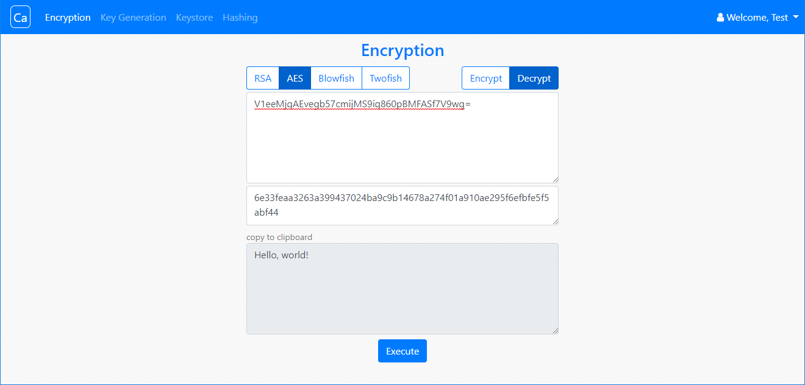
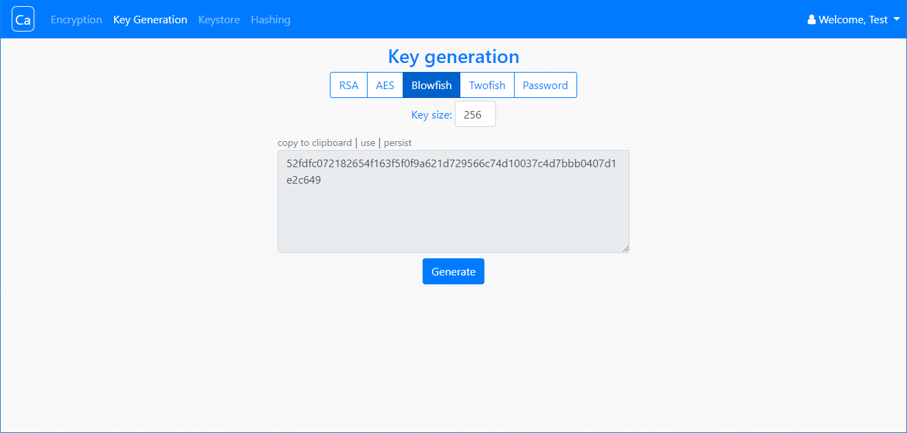
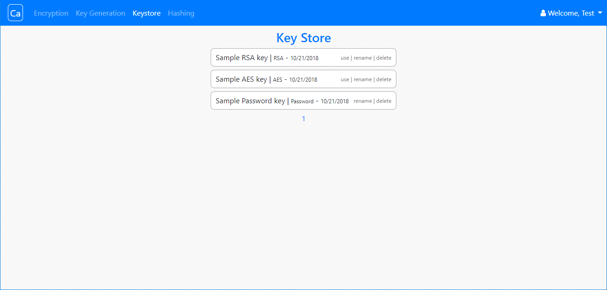
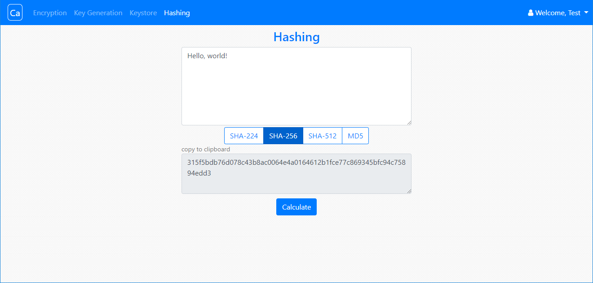

# Cadmium

Cadmium is a Go / Angular web application for mundane security-related problems:

- Encryption: RSA, AES, Blowfish, Twofish;

- Key generation: RSA, AES, Blowfish, Twofish, password;

- Hashing: MD5, SHA-224, SHA-256, SHA-512;

Using a MariaDB database it also features key persistence for authenticated users.

Project name comes from the periodic table of elements: Ca, atomic number 48.

## Setup 

1. Setup a MariaDB database and execute the SQL provided in 'database/db_init.sql'.

2. Compile the Go code by executing `go build` in 'backend' directory.

3. Create a 'config.json' file in the directory of the executable, see 'config-sample.json' for reference.

4. Configure the `appBackend` property in 'frontend/src/environments/environtment.prod.ts' and 'frontend/src/environments/environtment.ts' if needed.

5. Start the backend server.

6. Run `npm install` in 'frontend' directory.

7. Run `ng build --prod` in 'frontend' directory and set up a server to statically serve the generated 'dist' directory. Alternatively, run `ng serve --prod` in frontend directory.

## Usage

Navigate to the frontend server index location, which is `http://localhost:4200` if using `ng serve`.

Every page except for 'Key store' is accessible to guests. There is a preconfigured test user in the database: Test / Test, it comes with three persisted keys.

## Implementation

The Go API backend uses the [gorilla/mux](https://github.com/gorilla/mux) router and supports JWT authentication. Angular frontend, Bootstrap used for UI.